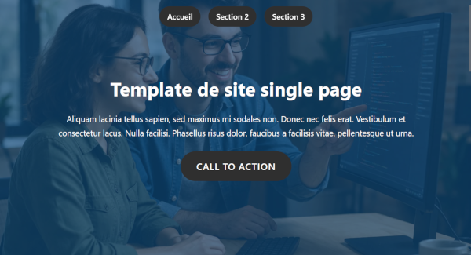
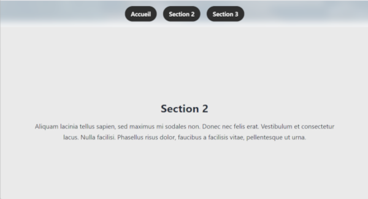

# Template HTML/CSS pour un site _single page_

> 📆 04/2026

Quelques détails resteront à améliorer en fonction de l'utilisation finale : 

* Marges menu/sections.
* Polices/taille, couleurs.
* Alignement des textes (actuellement centrés) des sections et ajout d'images sur les sections.
* Affichage sur mobile : menu, images. 
* SEO.
* Accessibilité.

